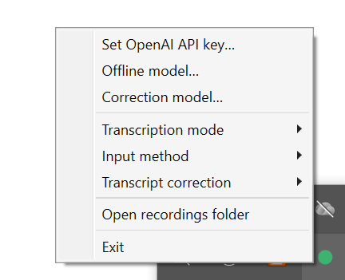
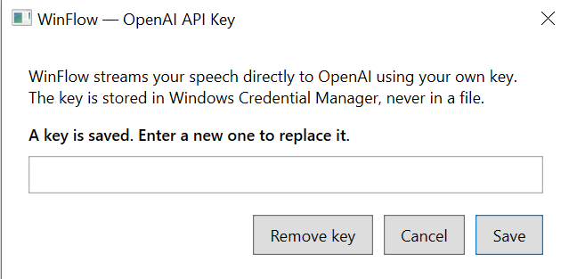
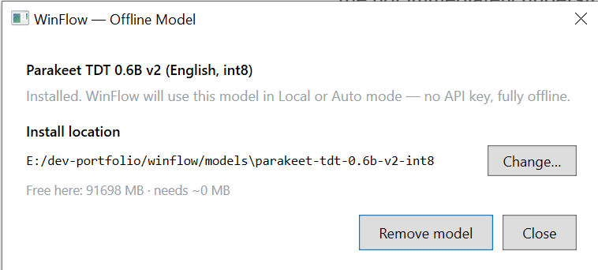
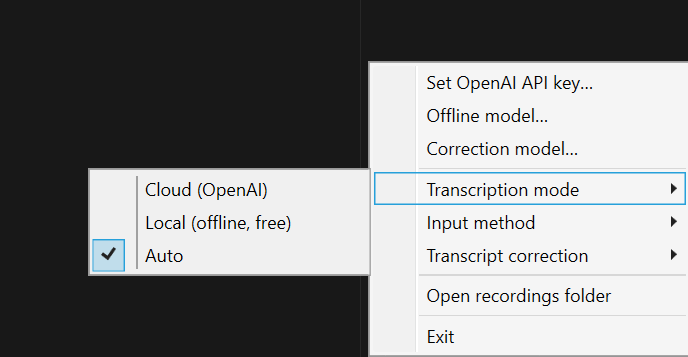
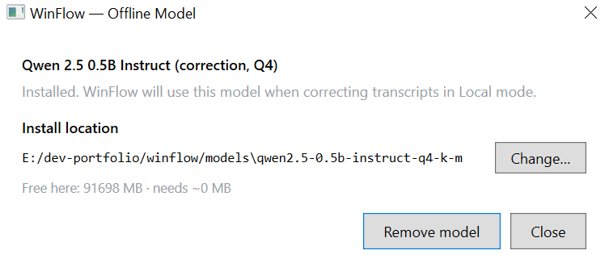
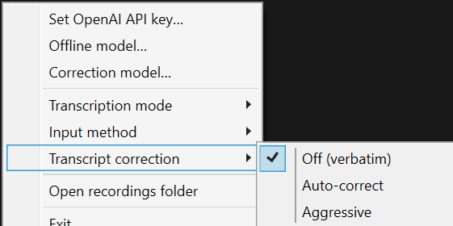
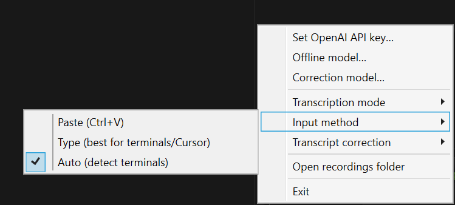

# WinFlow

**Voice dictation for Windows — hold a key, speak, release, and text appears at your cursor.**

WinFlow is a Windows-native push-to-talk dictation app inspired by [freeflow](https://github.com/mrinalwadhwa/freeflow). It runs in the system tray, captures your voice while you hold **Right Ctrl**, transcribes it with either OpenAI (cloud) or an on-device model (offline), and pastes the result into whatever app has focus — Notepad, VS Code, Cursor, browsers, terminals, Slack, and more.

## Demo

### Installation

Download the latest installer from **[GitHub Releases](https://github.com/user8088/winflow/releases)**:

| Installer | Size | Best for |
|-----------|------|----------|
| **WinFlow-Setup-*version*.exe** (Lite) | ~74 MB | Recommended — models download on first use (~1.1 GB, resumable) |
| **WinFlow-Setup-Full-*version*.exe** | ~992 MB | Fully offline immediately after install |

Both are per-user installs (no admin required). You choose the install location — offline models are stored there too.

> **SmartScreen:** The installer is unsigned. Click **More info → Run anyway** if Windows warns you.

### Setup walkthrough

After install, look for the gray dot in the system tray (click the **^** overflow arrow next to the clock if needed). Right-click it to open the menu:



#### 1. Cloud transcription (OpenAI)

Right-click → **Set OpenAI API key…** and paste your key (`sk-…`). Keys are stored in Windows Credential Manager — never written to disk.



#### 2. Offline transcription (free, no API key)

Right-click → **Offline model…** → **Download** (~631 MB). Pick an install drive with enough space. Once installed:



#### 3. Choose transcription mode

Right-click → **Transcription mode**:

| Mode | When to use |
|------|-------------|
| **Cloud (OpenAI)** | Best accuracy and latency; requires API key |
| **Local (offline, free)** | No internet or API key; uses Parakeet on-device |
| **Auto** | Offline model when installed, otherwise cloud |



#### 4. Optional: transcript correction

Right-click → **Transcript correction** → Off, Auto-correct, or Aggressive.

For offline correction, download the correction model under **Correction model…**:





#### 5. Input method (terminals & Cursor)

Right-click → **Input method**:

| Mode | When to use |
|------|-------------|
| **Paste (Ctrl+V)** | Most apps — Notepad, browsers, Word |
| **Type (best for terminals/Cursor)** | VS Code terminal, Cursor chat, PowerShell |
| **Auto (detect terminals)** | Recommended default |



#### 6. Dictate

Focus any text field, hold **Right Ctrl**, speak, release. A small HUD pill shows recording level and processing status.

## Features

- **Push-to-talk** — Hold Right Ctrl to record; release to transcribe and inject text
- **Works everywhere** — Clipboard paste or keystroke typing (Auto-detects terminals and Electron apps)
- **Cloud mode** — OpenAI Realtime API streams audio while you speak; batch fallback if streaming fails
- **Local mode (free, offline)** — NVIDIA Parakeet TDT 0.6B v2 via [sherpa-onnx](https://github.com/k2-fsa/sherpa-onnx)
- **Auto mode** — Uses the offline model when installed; otherwise falls back to cloud
- **Startup warmup** — Pre-loads models and mic on launch so the first dictation is fast
- **Long-form optimized** — Duration-scaled timeouts and chunked correction for long paragraphs
- **HUD overlay** — Always-on-top pill shows recording level, processing state, and feedback
- **Secure API key storage** — OpenAI keys in Windows Credential Manager (DPAPI-encrypted)
- **Resumable model downloads** — SHA256-verified; choose your install drive

## Quick start (build from source)

**Requirements:** Windows 10/11, [.NET 10 SDK](https://dotnet.microsoft.com/download)

```powershell
git clone https://github.com/user8088/winflow.git
cd winflow
dotnet build WinFlow.slnx -c Release
dotnet run --project src/WinFlow.App -c Release
```

See the [User Manual](docs/USER-MANUAL.md) for troubleshooting and advanced options.

## How it works

```
Hold Right Ctrl → WASAPI captures audio (24 kHz PCM)
                → Streaming STT (cloud) or batch STT (local)
                → Optional transcript correction
                → Text injected (paste or keystroke typing)
```

| Component | Technology |
|-----------|------------|
| App shell | WPF (tray icon, HUD overlay, dialogs) |
| Core logic | `WinFlow.Core` — testable pipeline with interface-based design |
| Hotkey | Low-level keyboard hook (`WH_KEYBOARD_LL`) on dedicated thread |
| Audio | NAudio (WASAPI shared mode) |
| Cloud STT | OpenAI Realtime WebSocket + batch fallback |
| Local STT | sherpa-onnx + Parakeet TDT 0.6B v2 (ONNX int8) |
| Text injection | Clipboard paste or Unicode keystrokes (Cursor/terminals) |
| Secrets | Windows Credential Manager |
| Settings | JSON in `%APPDATA%\WinFlow\settings.json` |

For the full design rationale, subsystem map, and roadmap, see [ARCHITECTURE.md](ARCHITECTURE.md).

## Project structure

```
winflow/
├── src/
│   ├── WinFlow.App/          # WPF tray app, HUD, settings dialogs
│   ├── WinFlow.Core/         # Dictation pipeline, STT, injection, audio
│   └── WinFlow.Core.Tests/   # xUnit + NSubstitute unit tests
├── docs/
│   ├── images/               # Screenshots for README and releases
│   └── USER-MANUAL.md        # End-user guide
├── installer/                # Inno Setup scripts and build.ps1
├── probes/LocalSttProbe/     # Standalone local STT smoke test
├── ARCHITECTURE.md
└── WinFlow.slnx
```

## Development

### Run tests

```powershell
dotnet test WinFlow.slnx -c Release
```

### Build installers

Requires [Inno Setup 6](https://jrsoftware.org/isinfo.php) and both offline models in `.\models` (download via the app first, then copy from `%LOCALAPPDATA%\WinFlow\models`):

```powershell
powershell -ExecutionPolicy Bypass -File installer\build.ps1 -Version 1.1.0
```

### Debug environment variables

| Variable | Effect |
|----------|--------|
| `WINFLOW_FAKE_STT=1` | Use fake transcriber (no network or model) |
| `WINFLOW_ALLOW_INJECTED=1` | Hotkey reacts to synthetic key events (automated tests) |
| `WINFLOW_SAVE_RECORDINGS=1` | Save every take as WAV under `%APPDATA%\WinFlow\recordings` |
| `WINFLOW_MODELS_DIR` | Override default local model directory |

## Contributing

Contributions are welcome. Please open an issue before large changes. Run `dotnet test` before submitting a pull request.

## Acknowledgments

WinFlow is a from-scratch Windows implementation inspired by [freeflow](https://github.com/mrinalwadhwa/freeflow) (Apache-2.0). The local speech model is [NVIDIA Parakeet TDT 0.6B v2](https://huggingface.co/csukuangfj/sherpa-onnx-nemo-parakeet-tdt-0.6b-v2-int8) distributed via sherpa-onnx.

## License

[Apache License 2.0](LICENSE)
