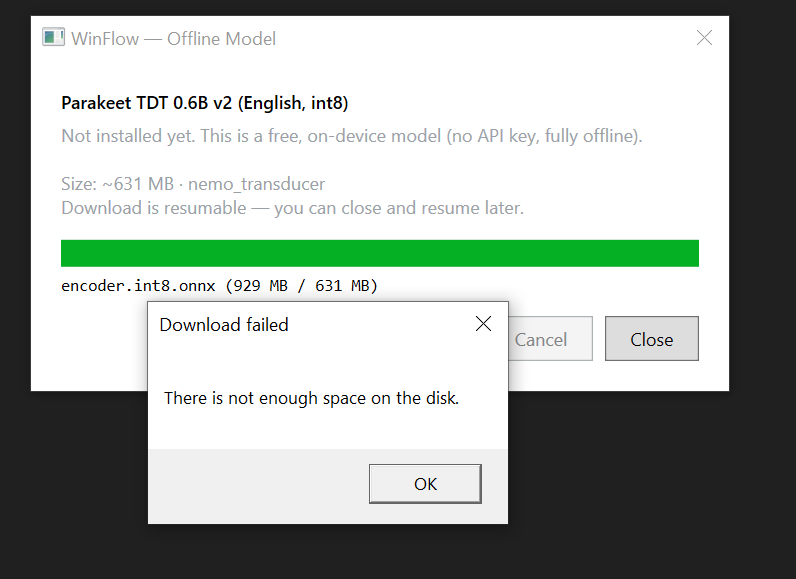

# WinFlow

**Voice dictation for Windows — hold a key, speak, release, and text appears at your cursor.**

WinFlow is a Windows-native push-to-talk dictation app inspired by [freeflow](https://github.com/mrinalwadhwa/freeflow). It runs in the system tray, captures your voice while you hold **Right Ctrl**, transcribes it with either OpenAI (cloud) or an on-device model (offline), and pastes the result into whatever app has focus — Notepad, VS Code, browsers, terminals, Slack, and more.



## Features

- **Push-to-talk** — Hold Right Ctrl to record; release to transcribe and inject text
- **Works everywhere** — Clipboard-based paste works in most Windows apps
- **Cloud mode** — OpenAI Realtime API streams audio while you speak for low latency; batch fallback races if streaming fails
- **Local mode (free, offline)** — NVIDIA Parakeet TDT 0.6B v2 via [sherpa-onnx](https://github.com/k2-fsa/sherpa-onnx); no API key required
- **Auto mode** — Uses the offline model when installed; otherwise falls back to cloud
- **HUD overlay** — Small always-on-top pill shows recording level, processing state, and success/error feedback
- **Secure API key storage** — OpenAI keys stored in Windows Credential Manager (DPAPI-encrypted)
- **Resumable model downloads** — ~631 MB offline model with SHA256 verification; pick your install drive

## Quick start

### Option A: Build from source

**Requirements:** Windows 10/11, [.NET 10 SDK](https://dotnet.microsoft.com/download)

```powershell
git clone https://github.com/YOUR_USERNAME/winflow.git
cd winflow
dotnet build WinFlow.slnx -c Release
dotnet run --project src/WinFlow.App -c Release
```

Look for the gray dot in the system tray (click the **^** overflow arrow next to the clock if needed).

### Option B: Use a release (when available)

Download the latest `WinFlow.App` from [GitHub Releases](https://github.com/YOUR_USERNAME/winflow/releases) and run `WinFlow.App.exe`.

### First-time setup

1. **Cloud:** Right-click the tray icon → **Set OpenAI API key…** and paste your key (`sk-…`)
2. **Offline:** Right-click → **Offline model…** → **Download** (~631 MB free disk space required)
3. **Mode:** Right-click → **Transcription mode** → Cloud, Local, or Auto
4. **Dictate:** Focus any text field, hold **Right Ctrl**, speak, release

See the [User Manual](docs/USER-MANUAL.md) for full instructions, troubleshooting, and advanced options.

## How it works

```
Hold Right Ctrl → WASAPI captures audio (24 kHz PCM)
                → Streaming STT (cloud) or batch STT (local)
                → Transcript pasted via clipboard + Ctrl+V
                → Clipboard restored
```

| Component | Technology |
|-----------|------------|
| App shell | WPF (tray icon, HUD overlay, dialogs) |
| Core logic | `WinFlow.Core` — testable pipeline with interface-based design |
| Hotkey | Low-level keyboard hook (`WH_KEYBOARD_LL`) on dedicated thread |
| Audio | NAudio (WASAPI shared mode) |
| Cloud STT | OpenAI Realtime WebSocket + batch fallback |
| Local STT | sherpa-onnx + Parakeet TDT 0.6B v2 (ONNX int8) |
| Text injection | Clipboard save → Ctrl+V → clipboard restore |
| Secrets | Windows Credential Manager |
| Settings | JSON in `%APPDATA%\WinFlow\settings.json` |

For the full design rationale, subsystem map, and roadmap, see [ARCHITECTURE.md](ARCHITECTURE.md).

## Project structure

```
winflow/
├── src/
│   ├── WinFlow.App/          # WPF tray app, HUD, settings dialogs
│   ├── WinFlow.Core/         # Dictation pipeline, STT, injection, audio
│   └── WinFlow.Core.Tests/   # xUnit + NSubstitute unit tests
├── probes/LocalSttProbe/     # Standalone local STT smoke test
├── ARCHITECTURE.md           # Design doc and implementation plan
├── docs/USER-MANUAL.md       # End-user guide
└── WinFlow.slnx
```

## Development

### Run tests

```powershell
dotnet test WinFlow.slnx -c Release
```

### Debug environment variables

| Variable | Effect |
|----------|--------|
| `WINFLOW_FAKE_STT=1` | Use fake transcriber (no network or model) |
| `WINFLOW_ALLOW_INJECTED=1` | Hotkey reacts to synthetic key events (automated tests) |
| `WINFLOW_SAVE_RECORDINGS=1` | Save every take as WAV under `%APPDATA%\WinFlow\recordings` |
| `WINFLOW_MODELS_DIR` | Override default local model directory |

### Current status

WinFlow is actively developed. Implemented today:

- Push-to-talk hotkey, audio capture, HUD, tray UI
- Cloud transcription (streaming + batch race) with warm WebSocket pool
- Local offline transcription (Parakeet via sherpa-onnx)
- Clipboard text injection with restore
- API key management, model download UI, STT mode switching

Planned (see [ARCHITECTURE.md](ARCHITECTURE.md)):

- LLM polish pass for messy transcripts
- Per-app injection strategies (UIA, SendInput)
- Settings/onboarding WebView2 UI
- Auto-update (Velopack), winget distribution
- Custom vocabulary, dictation history, per-app profiles

## Contributing

Contributions are welcome. Please open an issue before large changes. Run `dotnet test` before submitting a pull request.

## Acknowledgments

WinFlow is a from-scratch Windows implementation inspired by [freeflow](https://github.com/mrinalwadhwa/freeflow) (Apache-2.0). The local speech model is [NVIDIA Parakeet TDT 0.6B v2](https://huggingface.co/csukuangfj/sherpa-onnx-nemo-parakeet-tdt-0.6b-v2-int8) distributed via sherpa-onnx.

## License

[Apache License 2.0](LICENSE)
